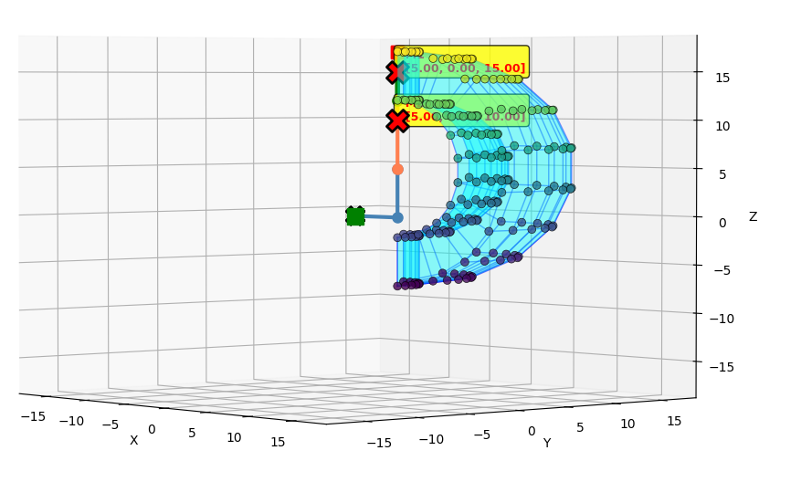

# Python Toolbox for Kinematics of 3-DOF (RRP) Polar Robotic Arm

## 9. รายละเอียดการดำเนินการ
### 9.x หาวิธีการคำนวณการแบ่ง sample สำหรับ plot 3D ใน workspace
หาวิธีที่จะสามารถ plot workspace ด้วยการทำ function plot_workspace_3d() ได้โดยสามารถปรับความละเอียดของการคำนวณเพื่อลดการประมวลผลหรือเพิ่มความละเอียดได้ โดยจำเป็นต้องหาวิธีหาทุกจุดที่เป็นไปได้โดยที่ยังสามารถ plot เป็น 3D ในคอมพิวเตอร์ได้อยู่ จึงจำเป็นต้องแบ่งเป็น sample ที่มีช่วงระยะห่างเท่ากันสำหรับการนำไปประมวลผล จึงได้ไปหาวิธีการได้เป็นดังต่อไปนี้

#### Singularity Detection Sampling (function find_singularitie)

สำหรับการหา singularity positions จะใช้การ sample จุดระหว่างค่าใน workspace ทั่วไปโดยอิงความละเอียดตามจำนวน input Sample ที่สามารถคำนวณได้ โดยจุดประสงค์เพื่อมาจุดที่อาจจะ cover จุดที่มุมใน workspace ปกติหาไม่ได้

$$N_1^{sing} = \max(8, \lfloor N_1/2 \rfloor)$$

$$N_2^{sing} = \max(8, \lfloor N_2/2 \rfloor)$$

$$N_3^{sing} = \max(5, \lfloor N_3/2 \rfloor)$$

- $N_1^{sing}$ คือจำนวนจุดที่จะคำนวณ singularity ของ $\theta_1$: ใช้สูตร $\max(8, \lfloor N_1/2 \rfloor)$ ซึ่งหมายถึงใช้ค่าที่มากกว่า ระหว่าง 8 หรือครึ่งหนึ่งของ theta1_samples
- $N_2^{sing}$ คือจำนวนจุดที่จะคำนวณ singularity ของ $\theta_2$: ใช้สูตร $\max(8, \lfloor N_2/2 \rfloor)$ ซึ่งหมายถึงใช้ค่าที่มากกว่า ระหว่าง 8 หรือครึ่งหนึ่งของ theta2_samples
- $N_3^{sing}$ คือจำนวนจุดที่จะคำนวณ singularity ของ $d_3$: ใช้สูตร $\max(5, \lfloor N_3/2 \rfloor)$ ซึ่งหมายถึงใช้ค่าที่มากกว่า ระหว่าง 5 หรือครึ่งหนึ่งของ d3_samples

ในส่วนของการออกแบบเพื่อหา singularity ได้เขียน code เป็นดังนี้
```python
singularity_positions, singularity_configs = self.find_singularities(
            theta1_samples=max(8, theta1_samples//2), 
            theta2_samples=max(8, theta2_samples//2), 
            d3_samples=max(5, d3_samples//2)
)
```

โดยภายใน singularity จะทำการหา det ว่าเป็น singularity หรือไม่ หากใช่ให้เก็บจุดนั้นไว้เพื่อคำนวณว่า end effector ตอนนั้นอยู่ในจุดไหนเป็นดังนี้
```python
for theta1 in theta1_range:
            for theta2 in theta2_range:
                for d3 in d3_range:
                    try:
                        # Get the reduced Jacobian (3x3)
                        J, reduced_J = self.get_RRP_Jacobian_Matrix([theta1, theta2, d3])
                        
                        # Compute determinant
                        J_array = np.array(reduced_J)
                        det = np.linalg.det(J_array)
                        
                        # Check if singular
                        if abs(det) < singularity_threshold:
                            position = self.Forward_Kinematics([theta1, theta2, d3])
                            singularity_positions.append(position)
                            singularity_configs.append(([theta1, theta2, d3], position))
                    except:
                        # Skip invalid configurations
                        pass
```

#### Workspace Generation (function get_workspace)
ในการแบ่ง sample สำหรับค่าที่ plot ใน workspace จะอ้างอิงความละเอียดตาม sample ที่ตั้งค่าไว้ โดยใน $\theta_1,\theta_2$ จะคำนวนได้เป็นตามสมการนี้
$$\theta_1^{(i)} = \theta_1^{min} + \frac{\theta_1^{max} - \theta_1^{min}}{N_1 - 1} \cdot i, \quad i \in \{0, 1, \ldots, N_1-1\}$$

$$\theta_2^{(j)} = \theta_2^{min} + \frac{\theta_2^{max} - \theta_2^{min}}{N_2 - 1} \cdot j, \quad j \in \{0, 1, \ldots, N_2-1\}$$

$N$ คือจำนวณ sample ที่ตั้งค่าไว้ เป็นความละเอียดของแต่ละ parameter ที่ใส่มา

สำหรับ $d_3$ หากเป็นช่วงระหว่างกลาง จะใช้เป็นค่า $d_3$ ที่ต่ำที่สุด และค่า $d_3$ ที่สูงที่่สุด เพราะว่าเป็นช่วงที่ไม่จำเป็นต้องคำนวณ surface ที่สามารถไปถึง เพราะอยู่ในระนาบเดียวกัน จึงสามารถลดการประมวลผลไปได้สำหรับ $d_3$

$$d_3^{(k)} = \begin{cases} d_3^{min} & k = 0 \\ d_3^{max} & k = 1 \end{cases}$$

โดยนำมาเขียนเป็น code ได้ดังนี้
```python
# Generate samples
        theta1_range = [theta1_min + (theta1_max - theta1_min) * i / (theta1_samples - 1) for i in range(theta1_samples)]
        theta2_range = [theta2_min + (theta2_max - theta2_min) * i / (theta2_samples - 1) for i in range(theta2_samples)]
        d3_range = [d3_min, d3_max]
```

เมื่อได้ parameter ของทุกตัวแล้ว จะนำมาคำนวณหา end effector ด้วย forward kinematic ของทุกตัว และนำมา plot ค่าภายใน workspace โดยทุกค่าที่จะอยู่ใน workspace จะได้เป็นดังสมการนี้

$$\mathcal{W} = \{\mathbf{p}_{ee}(\theta_1^{(i)}, \theta_2^{(j)}, d_3^{(k)}) : i \in [0, N_1-1], j \in [0, N_2-1], k \in \{0,1\}\}$$


#### Edge and Face Generation

หลังจากที่ได้จุดใน workspace ทุกตัว จะนำค่าที่ได้ plot เป็น 3D โดยนิยามให้จุดแต่ละจุดเรียกว่า vertex และเส้นที่เชื่อมระหว่างสองจุดเรียกว่า edge และการ plot สี่เหลี่ยมด้วย 4 vertex ว่า face

ในการ plot แต่ละ vertex สามารถ plot ได้ดังนี้

ให้ $P_{map}$ คือจุดที่จะ plot เป็น vertex ใน 3D workspace

$$P_{map}(i, j, k) \in \mathbb{Z}, \quad (i, j, k) \in [0, N_1-1] \times [0, N_2-1] \times \{0, 1\}$$

สำหรับการเชื่อม edge จำเป็นต้องเชื่อม edge ในจุดที่เป็นขอบเท่านั้นเพื่อลดการสับสนในการแสดงผลเป็น workspace โดยจะมีอยู่ 3 รูปแบบ ได้แก่

ให้ $E$ คือ edge ที่จะเชื่อมในแต่ละ vertex

1. เชื่อม edge ของ d₃_min กับ d₃_max ในกรณีที่อยู่ ณ ตรงขอบผิวของ Workspace
$$E_{d_3} = \{(P_{map}(i,j,0), P_{map}(i,j,1)) : i \in \{0, N_1-1\} \lor j \in \{0, N_2-1\}\}$$

2. เชื่อม edge ในกรณีที่จุดที่ plot มี θ₂ ที่ต่อเนื่องกัน
$$E_{\theta_2} = \{(P_{map}(i,j,k), P_{map}(i,j+1,k)) : i \in [0, N_1-1], j \in [0, N_2-2], k \in \{0,1\}\}$$

3. เชื่อม edge ในกรณีที่จุดที่ plot มี θ₁ ที่ต่อเนื่องกัน
$$E_{\theta_1} = \{(P_{map}(i,j,k), P_{map}(i+1,j,k)) : i \in [0, N_1-2], j \in [0, N_2-1], k \in \{0,1\}\}$$

ลองเขียนเป็น coding ได้เป็นดังนี้
```python
# Connect edges along d3 direction (within same theta1, theta2)
        # Only connect d3_min to d3_max at theta2 boundaries (theta2_min and theta2_max)
        for i in range(theta1_samples):
            for j in range(len(theta2_range)):
                # Check if this is a boundary theta2
                is_theta2_boundary = (j == 0 or j == len(theta2_range) - 1)
                
                idx_min = point_map.get((i, j, 0))
                idx_max = point_map.get((i, j, 1))
                
                if idx_min is not None and idx_max is not None and idx_min < len(ws_array) and idx_max < len(ws_array):
                    # Only draw d3 connection if at theta2 boundary
                    if is_theta2_boundary:
                        p_min = ws_array[idx_min]
                        p_max = ws_array[idx_max]
                        ax.plot3D([p_min[0], p_max[0]], [p_min[1], p_max[1]], [p_min[2], p_max[2]], 
                                 'b-', linewidth=1, alpha=0.5)
        
        # Also connect edges along d3 direction at theta1 boundaries (theta1_min and theta1_max)
        for i in [0, theta1_samples - 1]:
            for j in range(len(theta2_range)):
                idx_min = point_map.get((i, j, 0))
                idx_max = point_map.get((i, j, 1))
                
                if idx_min is not None and idx_max is not None and idx_min < len(ws_array) and idx_max < len(ws_array):
                    p_min = ws_array[idx_min]
                    p_max = ws_array[idx_max]
                    ax.plot3D([p_min[0], p_max[0]], [p_min[1], p_max[1]], [p_min[2], p_max[2]], 
                             'b-', linewidth=1, alpha=0.5)
        
        # Connect edges along theta2 direction (within same theta1, d3)
        # Draw at all theta1 values to fully connect the structure
        for i in range(theta1_samples):
            for d3_idx in range(2):
                for j in range(len(theta2_range) - 1):
                    idx_curr = point_map.get((i, j, d3_idx))
                    idx_next = point_map.get((i, j + 1, d3_idx))
                    
                    if idx_curr is not None and idx_next is not None and idx_curr < len(ws_array) and idx_next < len(ws_array):
                        p_curr = ws_array[idx_curr]
                        p_next = ws_array[idx_next]
                        ax.plot3D([p_curr[0], p_next[0]], [p_curr[1], p_next[1]], [p_curr[2], p_next[2]], 
                                 'b-', linewidth=1, alpha=0.5)
        
        # Connect edges along theta1 direction (within same theta2, d3)
        # Draw at all theta2 values to fully connect the structure
        for j in range(len(theta2_range)):
            for d3_idx in range(2):
                for i in range(theta1_samples - 1):
                    idx_curr = point_map.get((i, j, d3_idx))
                    idx_next = point_map.get((i + 1, j, d3_idx))
                    
                    if idx_curr is not None and idx_next is not None and idx_curr < len(ws_array) and idx_next < len(ws_array):
                        p_curr = ws_array[idx_curr]
                        p_next = ws_array[idx_next]
                        ax.plot3D([p_curr[0], p_next[0]], [p_curr[1], p_next[1]], [p_curr[2], p_next[2]], 
                                 'b-', linewidth=1, alpha=0.5)
```

ในการ plot face จะคำนวณ face ของทุกรูปแบบมา โดยที่ face จะต้องไม่ซ้อนกัน และ plot แค่เฉพาะในช่วงที่เป็นผิวเท่านั้น ซึ่งสามารถแก้ไขหน้าที่ซ้อนกันได้ด้วยวิธีการ union โดยกรณีของการ plot face จะมีวิธีการดูว่าตรงนี้มี face หรือไม่ ได้ 3 กรณีดังนี้

1. กรณี plot face ในช่วง θ₁ และ θ₂ ต่อเนื่องกัน และมีค่า d₃ เท่ากัน
$$F_A = \{[P_{map}(i,j,k), P_{map}(i+1,j,k), P_{map}(i+1,j+1,k), P_{map}(i,j+1,k)] : \forall i,j,k\}$$

2. กรณี plot face ในขณะที่ θ₁ อยู่ตรง limit
$$F_B = \{[P_{map}(i,j,0), P_{map}(i+1,j,0), P_{map}(i+1,j,1), P_{map}(i,j,1)] : i \in [0, N_1-2], j \in \{0, N_2-1\}\}$$

3. กรณี plot face ในขณะที่ θ₂ อยู่ตรง limit
$$F_C = \{[P_{map}(i,j,0), P_{map}(i,j+1,0), P_{map}(i,j+1,1), P_{map}(i,j,1)] : i \in \{0, N_1-1\}, j \in [0, N_2-2]\}$$

หลังจากนั้นจะทำทุก face มา union กันและ plot ค่า

$$\ F = F_A \cup F_B \cup F_C, \quad$$

ลองนำมาประยุกต์ใช้ใน code ได้เป็นดังนี้
```python
# Create faces from connected edges (avoid duplicates by tracking processed faces)
        from mpl_toolkits.mplot3d.art3d import Poly3DCollection
        
        faces = []
        face_set = set()  # Track processed faces to avoid duplicates
        
        # Create faces in theta2 direction (rectangular faces in theta1-theta2 plane)
        for i in range(theta1_samples - 1):
            for d3_idx in range(2):
                for j in range(len(theta2_range) - 1):
                    idx1 = point_map.get((i, j, d3_idx))
                    idx2 = point_map.get((i + 1, j, d3_idx))
                    idx3 = point_map.get((i + 1, j + 1, d3_idx))
                    idx4 = point_map.get((i, j + 1, d3_idx))
                    
                    if all(idx is not None and idx < len(ws_array) for idx in [idx1, idx2, idx3, idx4]):
                        # Create face as sorted tuple to avoid duplicates
                        face_key = tuple(sorted([idx1, idx2, idx3, idx4]))
                        if face_key not in face_set:
                            face_set.add(face_key)
                            p1 = ws_array[idx1]
                            p2 = ws_array[idx2]
                            p3 = ws_array[idx3]
                            p4 = ws_array[idx4]
                            faces.append([p1, p2, p3, p4])
        
        # Create faces in theta1 direction at theta2 boundaries (rectangular faces)
        for j in [0, len(theta2_range) - 1]:
            for i in range(theta1_samples - 1):
                idx1 = point_map.get((i, j, 0))
                idx2 = point_map.get((i + 1, j, 0))
                idx3 = point_map.get((i + 1, j, 1))
                idx4 = point_map.get((i, j, 1))
                
                if all(idx is not None and idx < len(ws_array) for idx in [idx1, idx2, idx3, idx4]):
                    face_key = tuple(sorted([idx1, idx2, idx3, idx4]))
                    if face_key not in face_set:
                        face_set.add(face_key)
                        p1 = ws_array[idx1]
                        p2 = ws_array[idx2]
                        p3 = ws_array[idx3]
                        p4 = ws_array[idx4]
                        faces.append([p1, p2, p3, p4])
        
        # Create faces in d3 direction at theta1 boundaries (rectangular faces)
        for i in [0, theta1_samples - 1]:
            for j in range(len(theta2_range) - 1):
                idx1 = point_map.get((i, j, 0))
                idx2 = point_map.get((i, j + 1, 0))
                idx3 = point_map.get((i, j + 1, 1))
                idx4 = point_map.get((i, j, 1))
                
                if all(idx is not None and idx < len(ws_array) for idx in [idx1, idx2, idx3, idx4]):
                    face_key = tuple(sorted([idx1, idx2, idx3, idx4]))
                    if face_key not in face_set:
                        face_set.add(face_key)
                        p1 = ws_array[idx1]
                        p2 = ws_array[idx2]
                        p3 = ws_array[idx3]
                        p4 = ws_array[idx4]
                        faces.append([p1, p2, p3, p4])
        
        # Plot faces with transparency
        if faces:
            face_collection = Poly3DCollection(faces, alpha=0.25, facecolor='cyan', edgecolor='none')
            face_collection.set_visible(toggle_state['faces_visible'])  # Initially hidden
            ax.add_collection3d(face_collection)
            face_collections.append(face_collection)  # Store for toggle button
```

หลังจากที่ขั้นตอนพื้นฐานแล้ว ได้มีการเพิ่มในส่วนของการซ่อนหรือแสดง vertex กับ face เข้ามาเพื่อให้ดูได้ง่ายขึ้นในบางมุม และเพิ่ม slidebar สำหรับการหมุนในแนวนอนและแนวตั้งในกรณีที่มุมการหมุนเมื่อหมุนแกนปกติเกิดความผิดเพี้ยนไป จะสามารถใช้ slidebar ที่ล็อคการหมุนมุมมองกล้องแทนได้

เมื่อทำเสร็จแล้ว ได้มีการเขียน readme เกี่ยวกับวิธีการใช้งาน function ที่มีมาให้ อธิบายถึงความแต่กต่าของแต่ละ parameter และรูปตัวอย่างการใช้งาน

## 11. validation
ทางผู้จัดทำต้องทำการทดสอบว่า workspace นี้เป็นพื้นที่ workspace ที่หุ่นแขนกลของหุ่นยนต์สามารถเคลื่อนที่ได้อย่างถูกต้องหรือไม่ จึงทำให้ในส่วนของการ plot workspace ต้องพิสูจน์ว่าค่าที่ plot ใน workspace นั้น ตรงกับการคำนวนจริงๆหรือไม่ โดยตรวจสอบด้วยวิธีการลองทำ forward kinematic ของทุกตำแหน่งที่ vertex มี แต่เนื่องจากการ plot เป็นแค่เพียง sample เท่านั้น ทำให้ไม่สามารถตรวจสอบได้ว่าค่าในช่วงระหว่างพื้นที่ workspace ถูกต้องหรือไม่ แต่จะสามารถพิสูจน์ได้จากตำแหน่งตรงขอบเขต เพราะทุกกรณีจะมี vertex ในจุดที่เป็น q1_max,q1_min,q2_max,q2_min,d3_max,d3_min อยู่เสมอในทุกกรณี จึงสามารถตรวจสอยได้ว่าค่าที่ plot นั้นถูกต้องได้จากขอบที่เกิดขึ้น จึงได้ตรวจสอบด้วยการหา forward kinematic เพื่อดูว่า ค่า end effector ที่ plot ใน workspace 3D ได้ plot จุดดังกล่าวหรื่อไม่

โดยในการทดสอบ จะทดสอบจากการลองเช็คค่า forward kinematic ของแต่ละ limit โดยยกตัวอย่างเป็นรูปแบบดังนี้
```python
link_params = [
    [(5, 0, 0), (0, 0, 5)],  # Link 1
    [(5, 0, 0)],              # Link 2
    [(0, 0, 0)]               # End Effector
]
joint_limits = [
    (0, 90),     # theta1 limits (degrees)
    (0, 180),    # theta2 limits (degrees)
    (0, 5)       # d3 limits (units)
]
```
โดยจะวัดตำแหน่งในขณะที่แขนหุ่นยนต์มี parameter ดังนี้
(0,0,0),(90,0,0),(0,180,0),(0,0,5),(90,180,0),(0,180,5),(90,0,5),(90,180,5)

ในการทดลอง จะใช้คำสั่ง interactive_plot() โดยเลื่อน parameter ไปยังตำแหน่งที่กำหนดไว้ข้างต้น และลองเปรียบเทียบกับค่าที่ได้ใน workspace ว่ามีต่ำแหน่งดังกล่าวหรือไม่
เช่น หากตั้ง parameter (q1,q2,d3) เป็น (0,0,0),(0,0,5) ควรจะมี vertex ณ ริมสุดในพิกัด (5,0,10),(5,0,15)
ซึ่งจากการทดลองพบว่า vertex เกิดการคลาดเคลื่อนออกไป



จากรูป จุด x สีแดงแสดงถึงตำแหน่งที่ vertex ณ ริมที่สุดควรจะอยู่ แต่เมื่อ plot ค่าจริง เกิดการคลาดเคลื่อนของตำแหน่งเกิดขึ้น หมายความว่า ตำแหน่งที่ workspace นี้แสดงยังไม่ถูกต้องทั้งหมด

จากปัญหาดังกล่าว คาดว่าสาเหตุเกิดจากระหว่างการ plot ค่าและการคำนวณอาจมีการคำนวณพลาดก่อนที่จะนำค่ามา plot ซึ่งทำให้เกิดปัญหาดังกล่าวขึ้น