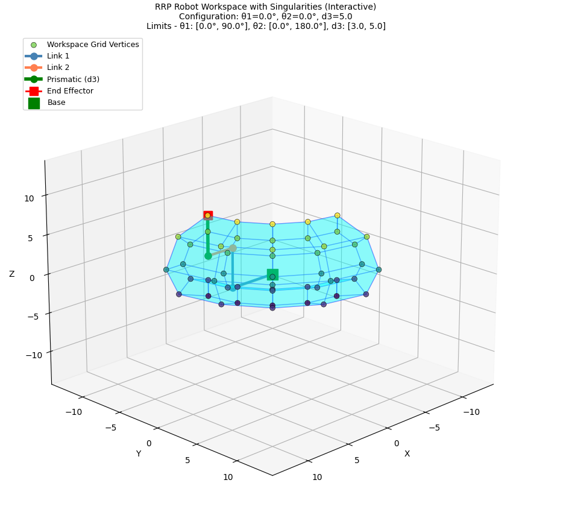
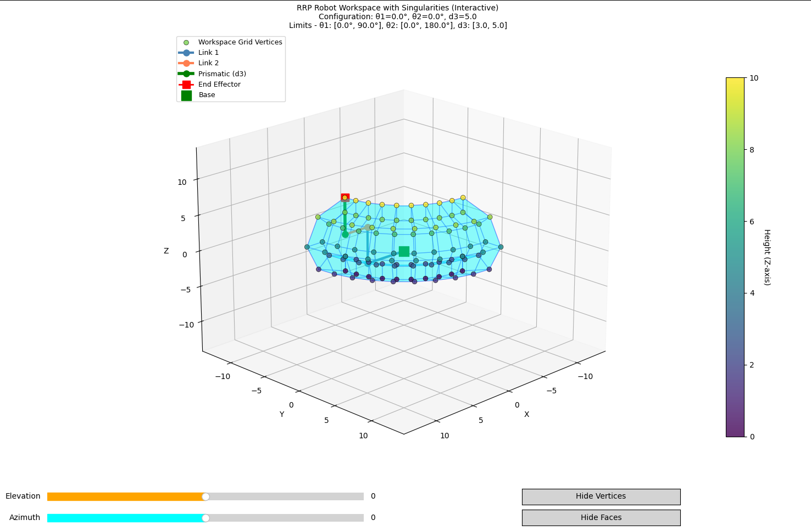
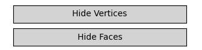
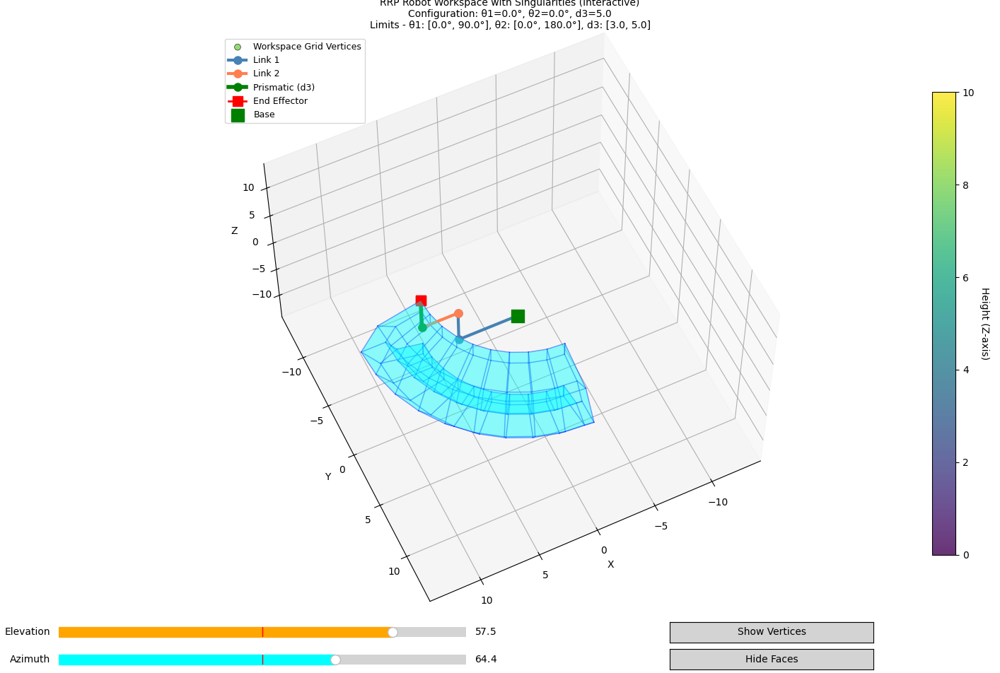
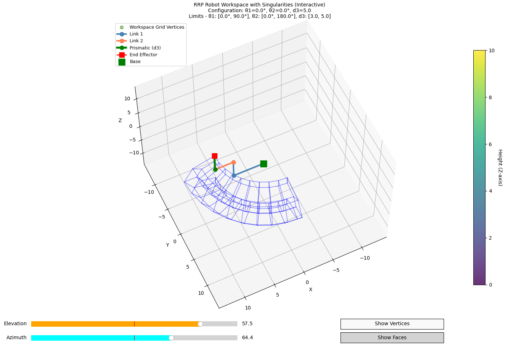
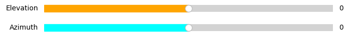
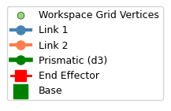

# การใช้งาน feature workspace เบื้องต้น
## Table of Contents

- [การใช้งาน feature workspace เบื้องต้น](#การใช้งาน-feature-workspace-เบื้องต้น)
  - [Table of Contents](#table-of-contents)
  - [หลักการคณิตศาสตร์ในการ Plot Workspace 3D](#หลักการคณิตศาสตร์ในการ-plot-workspace-3d)
  - [Installation \& Setup](#installation--setup)
  - [วิธีการใช้งานเบื้องต้น](#วิธีการใช้งานเบื้องต้น)
    - [1. Setup Toobox](#1-setup-toobox)
    - [2. Main function](#2-main-function)
    - [3. plot workspace](#3-plot-workspace)
  - [visualization-features](#visualization-features)
    - [controller component](#controller-component)
      - [1. hide vertice, hide face](#1-hide-vertice-hide-face)
      - [2. slidebar](#2-slidebar)
    - [visualization component](#visualization-component)
      - [1. กราฟแบ่งสีตามความสูง](#1-กราฟแบ่งสีตามความสูง)
      - [2. คำอธิบายสัญลักษณ์](#2-คำอธิบายสัญลักษณ์)
---

## หลักการคณิตศาสตร์ในการ Plot Workspace 3D

Workspace 3D ที่แสดงออกมาเป็นช่วงขอบเขตที่ปลายแขนหุ่นยนต์(end effector) สามารถเคลื่อนที่ไปได้ โดยใช้นำค่า sampling จุดตัวอย่างในระหว่างขอบเขตที่กำหนดไว้ไปคำนวณโดยใช้วิธี forward kinematics.

---


## Installation & Setup
Install library ที่ใช้
```bash
pip install numpy matplotlib scipy
```
import Toolbox
```python
from RRPToolbox import RRPToolbox
from RRPVisualization import RRPVisualization
```
---
## วิธีการใช้งานเบื้องต้น
1. [Setup Toolbox แขนหุ่นยนต์ RRP](#1-setup-toobox)
2. [ลอง plot workspace](#2-plot-workspace)
3. [ลองใช้ component ที่มีใน plot workspace](#visualization-features)

### 1. Setup Toobox
```python
RRPToolbox(link_params, joint_limits)
```
**Parameter ใน link param**

ในส่วนของ link_params ประกอบไปด้วย list 3 ตัว โดยภายใน list จะมี vector xyz ที่บอกขนาดของแต่ละ link และหากเพิ่ม vector xyz เพิ่ม คือการเพิ่มข้อต่อเข้ามา

```python
# Define link parameters (x, y, z segments for each link)
link_params = [
    [(5, 0, 0), (0, 0, 5)],  # Link 1: segments
    [(3, 0, 0)],              # Link 2: segments
    [(0, 0, 0)]               # End Effector: segments
]
```
**Parameter ใน joint_limits**

ภายใน joint limit จะประกอบไปด้วย vector 3 ตัว เป็นการบอกขอบเขตของแต่ละ joint ว่าแขนกลหุ่นยนต์สามารถขยับได้ในขอบเขตไหนบ้าง โดยมีระยะมากสุดที่ (-180,180) แต่สำหรับตัวแปร d3 จะเป็นขอบเขตการเคลื่อนที่แบบ prismetric ซึ่งไม่มีขอบเขตจำกัด

```python
# Define joint limits
joint_limits = [
    (0, 90),      # theta1 limits (degrees)
    (0, 180),     # theta2 limits (degrees)
    (3, 5)        # d3 limits (meters)
]
```
### 2. Main function
```python
Configuration_Space_Calculation(self, target_position, target_velocity, config=False)
```
**Parameter**
- `target_position`: ตำแหน่งปลายแขนที่ต้องการ
- `target_velocity`: ความเร็วปลายแขนที่ต้องการ
**Output**
ตำแหน่งและความเร็วใน configuration space

```python
Task_Space_Calculation(self, joint_config, joint_velocity, config=False)
```
**Parameter**
- `joint_config`: ตำแหน่ง configuration space
- `joint_velocity`: ความเร็ว configuration space
**Output**
ตำแหน่งและความเร็วของ end effector

```python
forward_kinematics(theta1, theta2, d3)
```
**Parameter**
- `theta1`: มุมของข้อต่อที่ 1 (degrees)
- `theta2`: มุมของข้อต่อที่ 2 (degrees)  
- `d3`: ระยะการเคลื่อนที่แบบ prismatic ของข้อต่อที่ 3 (meters)

**Output**
- ตำแหน่ง (x, y, z) ของ end effector

**Error handler**
- ตรวจสอบว่าค่าพารามิเตอร์อยู่ในขอบเขตที่กำหนดใน joint_limits หรือไม่ ถ้าตัวแปรไม่ครบจะ return ว่าค่าไหนเกิน limit parameter

---

```python
inverse_kinematics(x, y, z)
```
**Parameter**
- `x`, `y`, `z`: พิกัดเป้าหมายของ end effector (meters)

**Output**
- (theta1, theta2, d3): ค่ามุมและระยะของแต่ละข้อต่อ

**Error handler**
- เช็คกรณีเกิด singularity หรือสามารถไปถึงจุดปลายได้ไหม

---

```python
differential_forward_kinematics(self, joint_velocities, joint_config=None)
```
**Parameter**
- `theta1`, `theta2`: มุมของข้อต่อ (degrees)
- `d3`: ระยะการเคลื่อนที่แบบ prismatic (meters)

**Output**
- ความเร็ว end effector เป็น Jacobian matrix (vx,vy,vz)

**Error handler**
- เช็คกรณีเกิด singularity ของ Jacobian matrix 

```python
differential_inverse_kinematics(self, target_velocities, joint_config=None)
```
**Parameter**
- `target_velocities`:ความเร็วของ end effector ที่ต้องการ

**Output**
- ความเร็วของ configuration space


****

### 3. plot workspace
```python
# Plot workspace
toolbox.plot_workspace_3d(theta1_samples=25, theta2_samples=25, d3_samples=15)
```
**Parameter ใน plot_workspace_3d**
(theta1_samples, theta2_samples, d3_samples)
ตัวแปรในแต่ละค่าคือการสร้างจำนวน sample ความละเอียดในการ render ของแต่ละแกน q1,q2,d3 ตัวอย่างเช่น
```python
toolbox.plot_workspace_3d(5, 5, 5)
```



```python
toolbox.plot_workspace_3d(10, 5, 5)
```


โดยค่าเบื้องต้นหากไม่ได้กำหนดจะอยู่ที่ (10,10,5)

## visualization-features
ลักษณะ UI เมื่อ plot workspace เรียบร้อยแล้ว



### controller component

#### 1. hide vertice, hide face
ใช้ซ่อน vertex กับ face ภายในรูป render ได้



ตัวอย่าง





#### 2. slidebar
Elevation เป็น slidebar หมุนทิศทางหันแบบ ขึ้น/ลง โดยมี limit ที่ (-90 -> 90) องศา
Azimuth เป็น slidebar หมุนตามทิศทางแนวนอนแบบ ซ้าย/ขวา โดยมี limit ที่ (-180 -> 180) องศา



### visualization component
#### 1. กราฟแบ่งสีตามความสูง
สีภายในเส้นดังกล่าวจะเป็นสีบางบอกแกน z ของ vertex เพื่อดูระดับความลึกของแต่ละ vertex


#### 2. คำอธิบายสัญลักษณ์
อธิบายถึง component ที่แสดงผลอยู่มีอะไรบ้าง

