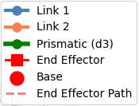
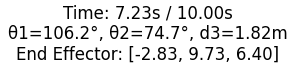

# การใช้งาน RRP Visualization

 Python Toolbox สำหรับจำลองแขนกล RRP (Revolute-Revolute-Prismatic) ด้วยการคำนวณจลนศาสตร์และการแสดงภาพ 3D

## Installation & Setup

### Install library ที่ใช้
```bash
pip install numpy matplotlib
```
### Import Toolbox
```python
from Optimize_Toolbox import RRPToolbox
```

## การกำหนดค่าหุ่นยนต์

### หุ่นยนต์ RRP ประกอบด้วย
- **Joint 1 (θ1)** : ข้อต่อ Revolute ที่ฐาน (การหมุนรอบแกน z) 
- **Joint 2 (θ2)** : ข้อต่อ Revolute (การหมุนรอบแกน y)
- **Joint 3 (d3)** : ข้อต่อ Prismatic (ส่วนขยายเชิงเส้น) 

- **Link 1** : ลิงค์ revolute (ควบคุมโดย θ1)
- **Link 2** : ลิงค์ข้อต่อ (ควบคุมโดย θ2)
- **Prismatic Link** : ส่วนขยายเชิงเส้น (d3)
- **End effector**

## Quick Start

### 1. กำหนดรูปร่างลิงค์ (x, y, z)
ในส่วนของการกำหนดรูปร่างลิงค์ ประกอบไปด้วย link_1 link_2 และ  end_effector โดยภายในลิงค์จะมี vector xyz ที่บอกขนาดของแต่ละ link และหากเพิ่ม vector xyz เพิ่ม คือการเพิ่มข้อต่อเข้ามา
```python
link_1 = [(5, 0, 0), (0, 0, 5)]    
link_2 = [(3, 0, 0)]                
end_effector = [(0, 0, 0.5)]        
```
### 2. กำหนด Joint limit และ Prismatic lenght
ภายใน joint_limits จะประกอบไปด้วย vector 3 ตัว เป็นการบอกขอบเขตของแต่ละ joint ว่าแขนกลหุ่นยนต์สามารถขยับได้ในขอบเขตไหนบ้าง โดยมีระยะมากสุดที่ (-180,180) แต่สำหรับตัวแปร d3 จะเป็นขอบเขตการเคลื่อนที่แบบ prismetric ซึ่งไม่มีขอบเขตจำกัด
```python
   joint_limits = [
        (-180, 180),  # theta1 limits (degrees)
        (0, 180),     # theta2 limits (degrees)
        (0, 11.0)     # d3 limits (meters)
    ]                  
```

## ตัวอย่างการใช้งาน

### 1. Interactive Visualization

```python
# Interactive visualization with sliders
robot.interactive_plot()
```
เป็นการ Visualizaiton ของแขนกล RRP โดยจะมี Slider ในการปรับเปลี่ยนองศาของ Joint1(θ1) Joint 2(θ2) และความยาวของ Prismatic link(d3)


### 2. Trajectory Visualization

แสดงการเคลื่อนที่ตามจุดหมายที่กำหนด โดยจุดหมายที่กำหนดจะมี vector xyz เป็นการบอกตำแหน่งที่แขนกลต้องเคลื่อนที่

```python
position_trajectory = [
    [3, 3, 8],
    [3, -3, 10],
    [-3, -3, 8],
    [-3, 3, 10],
    [3, 3, 8],
]
```
กำหนดระยะเวลาในการเคลื่อนที่ของแขนกล และเฟรมในการเคลื่อนที่
```python
robot.animate_trajectory(
    trajectory=position_trajectory,
    total_time=10,           
    trajectory_type='position',  
    fps=30                  
)
```


## Visualization Features and Components

### 1. Component list
แสดง component ที่แสดงผลอยู่มีอะไรบ้าง



### 2. Details
แสดงรายละเอึยดของแขนกลแบบ real-time



### 3. Slide bar
ปรับเปลี่ยนองศาของ Joint1(θ1) Joint 2(θ2) และความยาวของ Prismatic link(d3)


